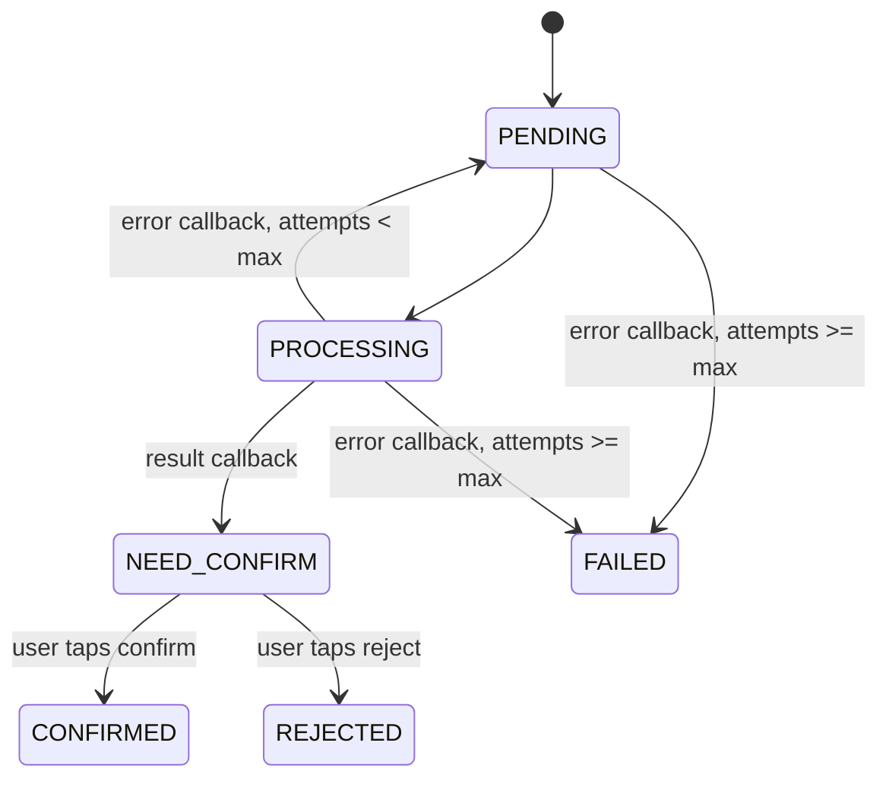

# OCR Integration

## Overview
This document describes the OCR integration for Telegram `/upload` images using RabbitMQ and a Python OCR worker.

The flow includes:
1. Queue OCR job when Telegram image upload succeeds.
2. Worker receives job message and requests a signed image URL.
3. Worker sends OCR result for user confirmation via inline Telegram buttons.
4. User confirms/rejects OCR output.
5. System saves transaction to correct table on confirm.
6. Worker errors trigger immediate retry up to configured max attempts.

---

## Architecture

```mermaid
flowchart LR
  U[Telegram User] -->|/upload + photo| TG[Telegram Bot / NestJS]
  TG -->|Upload image| SB[(Supabase Storage)]
  TG -->|Create ocr_jobs row| DB[(PostgreSQL)]
  TG -->|Publish {jobId,idempotencyKey,chatId,userId}| MQ[(RabbitMQ: ocr-ocr_jobs)]

  W[Python OCR Worker] -->|Consume message| MQ
  W -->|POST /api/v1/telegram/ocr-jobs/signed-url| TG
  TG -->|Create signed URL| SB
  TG -->|Return signedUrl| W

  W -->|OCR parse| OCR[OCR Engine]
  W -->|POST /api/v1/telegram/ocr-jobs/:jobId/result| TG
  TG -->|Set NEED_CONFIRM + send inline buttons| U

  U -->|✅/❌ callback| TG
  TG -->|CONFIRMED/REJECTED| DB
  TG -->|If confirmed: upsert deposit/certificate transaction| DB

  W -->|POST /api/v1/telegram/ocr-jobs/:jobId/error| TG
  TG -->|attempts < max: requeue immediately| MQ
  TG -->|attempts >= max: mark FAILED + notify user| U
```

---

## Queue Contract

### Exchange / Queue
- Exchange: `direct`
- Queue: `ocr-ocr_jobs`
- Routing key: `ocr-ocr_jobs`

### Message payload

```json
{
  "jobId": "uuid",
  "idempotencyKey": "tg_file_unique_id",
  "chatId": 123456789,
  "userId": 123456789
}
```

---

## HMAC Authentication
All worker-facing endpoints use `HmacSignatureGuard`.

### Required headers
- `X-Timestamp`: unix timestamp in milliseconds
- `X-Signature`: SHA-256 HMAC hex digest

### Canonical payload
`{timestamp}.{rawBody}`

### Secret
Use `ACTIVE_SECRET` from environment.

### Validation notes
- Request must be within 5 minutes of server time.
- Signature comparison uses timing-safe equality.

---

## Worker API Contract

### 1) Get signed URL
`POST /api/v1/telegram/ocr-jobs/signed-url`

Request:

```json
{
  "idempotencyKey": "AgAD..."
}
```

Response:

```json
{
  "signedUrl": "https://...",
  "expiresAt": 1770000000000
}
```

### 2) Submit OCR result
`POST /api/v1/telegram/ocr-jobs/:jobId/result`

Request:

```json
{
  "resultJson": {
    "transactionType": "DEPOSIT",
    "amount": 1000000,
    "transactionDate": "2026-01-15",
    "note": "Nap tien tu OCR"
  },
  "provider": "google-vision",
  "model": "vision-v1",
  "warnings": ["Low contrast image"]
}
```

Response:

```json
{
  "success": true,
  "jobId": "fcbf8f0b-2010-4e0a-9b06-53f786f51439",
  "status": "NEED_CONFIRM",
  "tgSentMessageId": "4812"
}
```

### 3) Submit OCR error
`POST /api/v1/telegram/ocr-jobs/:jobId/error`

Request:

```json
{
  "errorMessage": "OCR provider timeout while parsing image",
  "errorCode": "OCR_TIMEOUT"
}
```

Response (retry queued):

```json
{
  "success": true,
  "jobId": "fcbf8f0b-2010-4e0a-9b06-53f786f51439",
  "status": "PENDING",
  "attempts": 1,
  "maxAttempts": 2,
  "retried": true,
  "message": "OCR retry queued immediately"
}
```

Response (failed):

```json
{
  "success": true,
  "jobId": "fcbf8f0b-2010-4e0a-9b06-53f786f51439",
  "status": "FAILED",
  "attempts": 2,
  "maxAttempts": 2,
  "retried": false,
  "message": "OCR failed after 2 attempts"
}
```

---

## `resultJson` Schema Expectations

### DEPOSIT

```json
{
  "transactionType": "DEPOSIT",
  "transactionDate": "2026-01-15",
  "amount": 1000000,
  "note": "optional"
}
```

Maps to `deposit_transactions`:
- `transactionDate` -> `transaction_date`
- `amount` -> `capital`
- Generated idempotent source id -> `transaction_id` (format: `ocr_{jobId}`)

### CERTIFICATE

```json
{
  "transactionType": "CERTIFICATE",
  "transactionDate": "2026-01-15",
  "numberOfCertificates": 123.45,
  "price": 12000
}
```

Maps to `certificate_transactions`:
- `transactionDate` -> `transaction_date`
- `numberOfCertificates` -> `number_of_certificates`
- `price` -> `price`
- Generated idempotent source id -> `transaction_id` (format: `ocr_{jobId}`)

---

## Vietnamese Message Format

### OCR review message (NEED_CONFIRM)

```text
🧾 Kết quả OCR

📋 Loại: Gửi tiền
💰 Số tiền: 1.000.000 VND
📅 Ngày: 15/01/2026

Vui lòng kiểm tra và chọn Xác nhận hoặc Từ chối.
```

Buttons:
- `✅ Xác nhận` -> `ocr_confirm_{jobId}_{token}`
- `❌ Từ chối` -> `ocr_reject_{jobId}_{token}`

### Confirmed
`✅ Đã xác nhận và lưu giao dịch`

### Rejected
`❌ Đã từ chối`

### Final failure
`❌ Không thể xử lý ảnh sau 2 lần thử. Vui lòng thử lại hoặc nhập thủ công.`

---

## Database Schema and Status Flow

### Core columns (`ocr_jobs`)
- `id`
- `tg_file_unique_id`
- `tg_chat_id`
- `tg_user_id`
- `storage_bucket`
- `storage_path`
- `status`
- `attempts`
- `max_attempts`
- `result_json`
- `confirm_token`
- `tg_sent_message_id`
- `transaction_id`
- `confirmed_at`
- `rejected_at`
- `last_error`

### Status flow



---

## Troubleshooting

### 1) Worker cannot fetch signed URL
- Verify HMAC headers are present and valid.
- Check `ACTIVE_SECRET` matches worker secret.
- Ensure `idempotencyKey` exists in `ocr_jobs`.

### 2) Retry does not happen
- Verify `RABBITMQ_URL`, `RABBITMQ_EXCHANGE`, `RABBITMQ_QUEUE`.
- Check RabbitMQ publisher startup logs.
- Confirm job state is not finalized (`CONFIRMED`, `REJECTED`, `FAILED`).

### 3) Job always fails quickly
- Validate image accessibility via returned signed URL.
- Check OCR worker timeout and provider limits.
- Confirm `OCR_MAX_ATTEMPTS` value (default `2`).

### 4) Inline buttons do nothing
- Ensure callback data format remains exactly:
  - `ocr_confirm_{jobId}_{token}`
  - `ocr_reject_{jobId}_{token}`
- Verify `confirm_token` in DB matches callback token.

### 5) Duplicate transactions
- Confirm upsert uses deterministic `transaction_id = ocr_{jobId}`.
- Ensure callback for finalized jobs is rejected.
